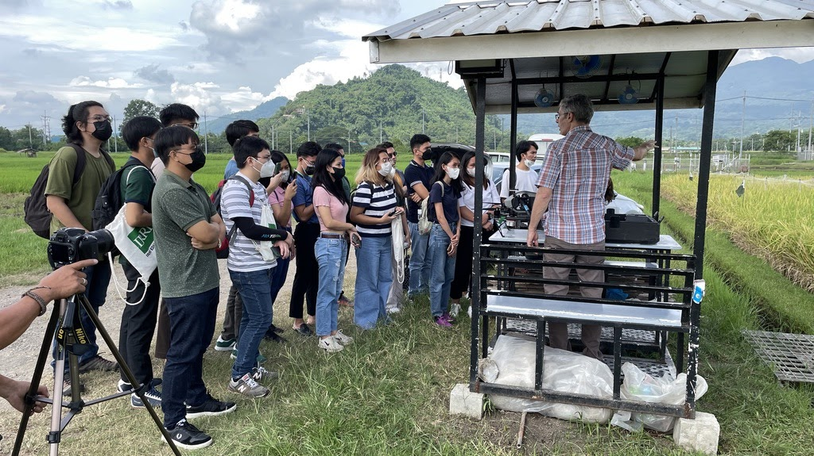

# Drone-Phenome Project

This is a directory for web applications related to high-throughput phenotyping using drones. Drone images are stored and viewable using Imagebreed. Data analysis can be done using CropGalaxy tools and machine learning for phenotype predictions using drone indices are also available. Training materials, SOPs and drone-related resources are also made available.

---

## **Web Tools** 

These web tools are developed at IRRI, adapting open-source web technologies. 

- <a href="http://breedbase.duckdns.org/" target="_blank">Breedbase-IRRI</a> 
- <a href="http://cropgalaxy.excellenceinbreeding.org/" target="_blank">CropGalaxy</a> 
- <a href="http://18.138.161.175:8080" target="_blank">Imagebreed-IRRI</a> 
- <a href="https://high-throuhghput-phenotyping.streamlit.app/" target="_blank">PhenoPredictML</a> 

---

## **Open-source Tools** 

These open-source tools are available for use in high-throughput data analysis. 

- <a href="https://breedbase.org/" target="_blank">Breedbase</a> 
- <a href="https://easyidp.readthedocs.io/en/latest/index.html" target="_blank">EasyIDP 2.0</a> 
- <a href="https://imagebreed.org/" target="_blank">ImageBreed</a> 
- <a href="https://github.com/OpenDroneMap/FIELDimageR" target="_blank">FIELDimageR</a> 
- <a href="https://www.opendronemap.org/" target="_blank">OpenDroneMap</a> 
- <a href="https://posit.co/download/rstudio-desktop/" target="_blank">RStudio Desktop</a> 

---

## **Standard Operating Procedures** 

- <a href="docs/Drone training manual v1.5.pdf" target="_blank">Drone-based mapping of agricultural fields</a> 
- <a href="docs/EiB_M4_ SOP-UAV-Phenotyping-12-10-20.pdf" target="_blank">Standard operating procedures for UAV phenotyping</a> 

---

## **Training Course** 

<table>
  <tr>
    <td style="vertical-align: top;">
      
    </td>
    <td style="padding-left: 20px; vertical-align: top;">
      
The Bioinformatics Team under the KOICA-UPLB-IRRI project designed <b>Basic Digital Phenotyping Course</b> which includes modules on High-Throughput Phenotyping using drones and ImageBreed.

      
For more information on the course, visit Basic Digital Phenotyping on <a href="https://openlearning.cgiar.org/" target="_blank">openlearning.cgiar.org</a>. The course was conducted last September 19 - November 22, 2024.

      
For future training opportunities, please visit the <a href="https://education.irri.org/" target="_blank">IRRI Education</a> website.  This is the text that will appear on the right side of the image.

    </td>
  </tr>
</table>

---
